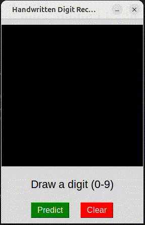

# Handwritten Digit Recognition with CNN and Drawing App

This project demonstrates a Convolutional Neural Network (CNN) trained to recognize handwritten digits (0–9) using the MNIST dataset. After training, the model is integrated into a small interactive application that lets users draw digits on a canvas and instantly get predictions from the network.

## Project Components
  
  - Dataset: MNIST (28x28 grayscale images of digits 0–9)
  - Model: CNN trained to classify handwritten digits
  - App: Interactive interface where users can draw digits and receive predictions in real time

## Features
  
  - Training a CNN on MNIST with high accuracy 
  - Saving and reusing the trained model
  - Drawing canvas for user input
  - Automatic preprocessing of drawings to match the CNN input
  - Real-time digit prediction

## Project Structure
```
├── images/              # Screenshots and demo media
│   ├── app_demo.gif     # Demo video
│   └── prediction_examples.png   # Screenshots of the model predictions 
├── models/              # Saved trained models 
├── notebooks/
│   └── train.ipynb      # Notebook to train, evaluate, and save the CNN
├── src/
|   ├── app.py           # Interactive drawing application
│   └── predict.py       # Preprocessing & prediction helper functions
│         
│   
├── README.md            # Project documentation
└── requirements.txt     # Python dependencies
```

## Installation & Usage
### Install dependencies:
```
pip install -r requirements.txt
```
### Train the model:
```
jupyter notebook notebooks/train.ipynb  
```
### Install dependencies:
```
cd src
python app.py
```
## Outcome

The final result is a CNN with strong classification performance on MNIST, deployed in a user-friendly app that allows anyone to draw a digit and immediately see the predicted result.

## Demo


